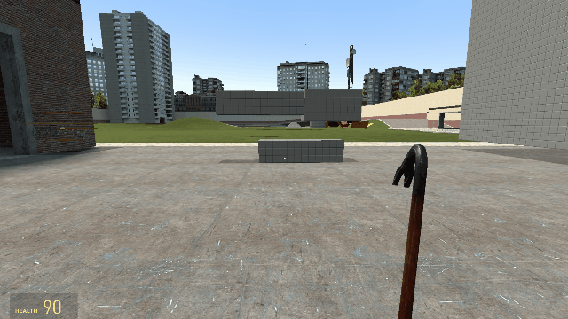

# teleporting-crowbar-v2
Scripted weapon for Garry's Mod.

**CURRENTLY UNDER DEVELOPMENT**

[](https://steamcommunity.com/link-to-your-workshop-item)
[](https://wiki.facepunch.com/gmod/)

**A fun teleporting crowbar for Garry's Mod.**



## Features

- Optimized teleporting, less getting stuck in walls.
- Options to enable visual debug mode.
- Small, lightweight, no dependencies.
- Adjusts velocity to negate fall damage.

## Installation

1. Download the latest release
2. Drag the folder into your `addons` folder

Installing through the steam workshop **COMING SOON**

## How to Use

- **Right Click** to teleport forward (with cooldown)
- **Left Click** to save the location
- **Type** `developer 1` and `tcenabledebug 1` for debug mode 

## Console Commands

```bash
tcenabledebug 1     # Enable debug mode.
tcenabledebug 0     # Disable debug mode
tcclear             # Clear the saved location
tcmute              # Mute the sounds that plays when teleporting
tcclear             # Clear the saved position.
```